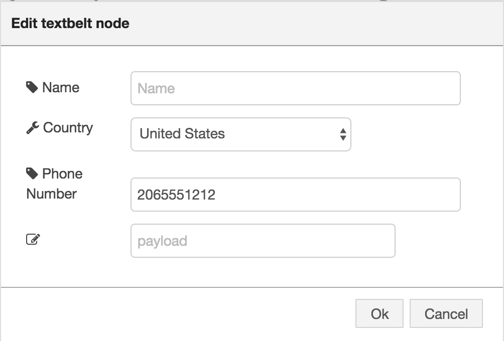

# Node Red Textbelt Node

This Node for Node Red supports sending SMS messages via [textbelt](http://textbelt.com).

By default the node sends the payload as the message. You can override this by specifying the message field <i>payload.message</i> or <i>topic</i>

